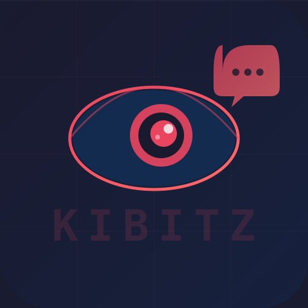

<p align="center">
  
</p>

<h1 align="center">Kibitz</h1>

<p align="center">
  A Slack bot that passively reads the channel and autonomously decides when to chime in.<br>
  Yiddish for an onlooker who offers unsolicited advice — literally what this bot does.
</p>

---

## Prerequisites

- **Python 3.11+**
- **Docker** (for SearXNG)
- **llama.cpp** with `--mmproj` support (for vision)
- A **Slack workspace** you admin

## Setup

### 1. Clone and install dependencies

```bash
cd slackbot
pip install -r requirements.txt
```

### 2. Create your `.env`

Copy the example and fill in your Slack tokens:

```bash
cp .env.example .env
```

```
SLACK_BOT_TOKEN=xoxb-...
SLACK_APP_TOKEN=xapp-...
LLAMA_CPP_URL=http://localhost:8080
SEARXNG_URL=http://localhost:8888
BOT_NAME=kibitz
CHANNEL_NAME=general
```

### 3. Slack app setup

1. Go to [api.slack.com/apps](https://api.slack.com/apps) and create a new app from scratch
2. Enable **Socket Mode** and generate an App-Level Token (`connections:write`) — this is your `SLACK_APP_TOKEN`
3. Add these **Bot Token Scopes** under OAuth & Permissions:
   - `channels:history`, `channels:read`, `chat:write`, `files:read`, `files:write`, `reactions:read`, `users:read`
4. Subscribe to the `message.channels` bot event
5. Install the app to your workspace and copy the **Bot User OAuth Token** — this is your `SLACK_BOT_TOKEN`
6. Invite the bot to your channel: `/invite @kibitz`

### 4. Start llama.cpp

```bash
llama-server \
  -m Qwen3.5-9B.Q8_0.gguf \
  --mmproj mmproj-BF16.gguf \
  --port 8080 \
  --host 127.0.0.1 \
  -c 8192 \
  -ngl 99
```

### 5. Start SearXNG

```bash
docker compose up -d
```

Verify it's running:

```bash
curl http://localhost:8888/search?q=test&format=json
```

### 6. Start the bot

```bash
python bot.py
```

On startup the bot verifies that llama.cpp, SearXNG, and Slack are all reachable. If anything is down it will log the error and exit.

## Configuration

Kibitz uses editable config files — no code changes needed to tune behavior:

| File | Purpose |
|------|---------|
| `config/personality.md` | Bot personality and tone (loaded as the LLM system prompt) |
| `config/heartbeat.md` | Scheduled autonomous tasks (news digest, quiet channel prompts) |
| `config/news_summary.yaml` | RSS feeds, relevance criteria, and digest settings |

All config files are re-read on use, so edits take effect without restarting the bot.

## Architecture

- **Slack** connects via Socket Mode (WebSocket, no public URL needed)
- **LLM** is a local Qwen 3.5 9B via llama.cpp's OpenAI-compatible API
- **Search** is self-hosted SearXNG in Docker
- **Two-tier response**: cheap triage on every message, full generation only when warranted
- **Two-phase factual answers**: quick gut reaction, then a researched follow-up via SearXNG
- **News digest**: daily RSS-based summary ranked by LLM, posted as threaded messages
